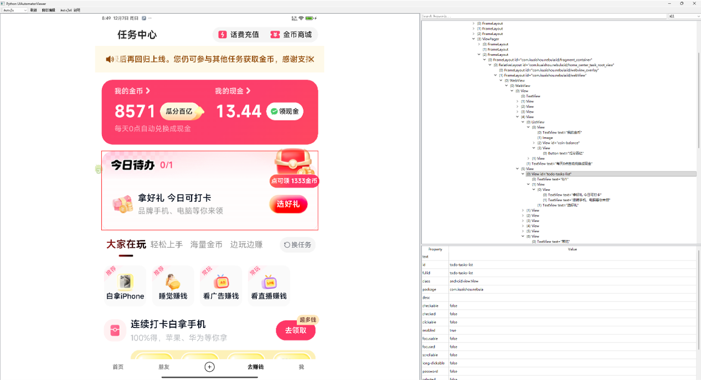
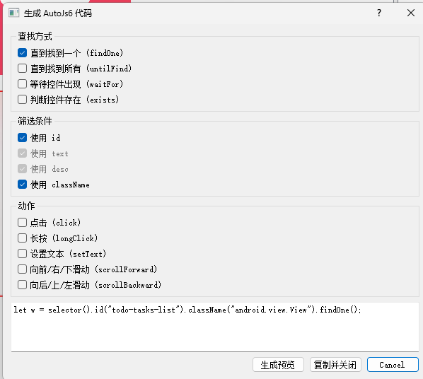
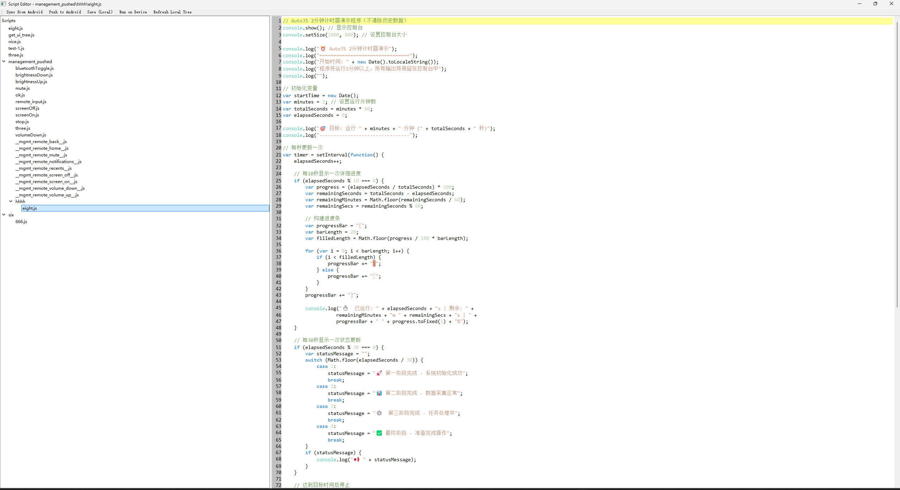

# Python UIAutomatorViewer（增强版）


一个使用 **Python + PyQt5** 实现的桌面版 UIAutomator Viewer，支持：

- 基于 `adb` 与 `uiautomator dump` 的传统 UI 层级树查看
- 与 **AutoJs6** 集成，通过无障碍服务获取更完整的控件树
- 截图与控件树联动，高亮选中控件
- 生成 AutoJs6 选择器与操作代码片段
- 内置 AutoJs6 脚本编辑器与文档浏览

> 运行环境：**Python 3.7 及以上**

---

## 功能特性

- **截图 + XML UI 树**：
  - 通过 `adb exec-out screencap` 获取当前屏幕截图
  - 通过 `uiautomator dump` 获取 `window_dump.xml`，解析为树形结构

- **AutoJs 模式（可选）**：
  - 自动向手机推送 `static/get_ui_tree.js` 脚本
  - 使用 AutoJs6 + 无障碍服务遍历 UI 树
  - 在手机端生成 `/sdcard/autojs_ui_tree.json`，PC 端拉取并展示

- **控件树浏览**：
  - 类似官方 uiautomatorviewer 的树形 UI 结构
  - 支持按关键字搜索、按控件类型过滤
  - 点击树节点，高亮截图中的对应区域；点击截图反向定位树节点

- **属性查看与 AutoJs 代码生成**：
  - 展示 `text / id / class / package / desc / bounds / center` 等属性
  - 右键属性表可生成：
    - 判断控件存在的函数
    - 常用 AutoJs 操作代码（`click / longClick / setText / scroll...`）

- **脚本编辑器**：
  - 针对 AutoJs6 的脚本编辑器，支持：
    - 代码高亮
    - 行号
    - 简单的自动补全（基于 AutoJs6 文档解析）
  - 支持从安卓同步脚本到本地、推送脚本到安卓、在设备上运行脚本

---

## 环境要求

- **Python**：3.8+（推荐 3.10+）
- **操作系统**：Windows（当前开发环境）
- **依赖工具**：
  - 已安装并配置到 `PATH` 的 `adb`
  - 一台已开启 **USB 调试** 的 Android 设备
  - （可选）安装并配置好的 **AutoJs6**（用于 AutoJs 模式）

---

## 安装依赖

1. 克隆仓库：

```bash
git clone https://github.com/shiyaaini/py_uiautomatorviewer.git
cd py_uiautomatorviewer
```

2. 创建并激活虚拟环境（推荐）：

```bash
python -m venv .venv
".venv\\Scripts\\activate"  # Windows
```

3. 安装 Python 依赖：

> 项目使用 PyQt5 等第三方库，请根据你的实际 `requirements.txt`/依赖文件安装。

示例：

```bash
pip install -r requirements.txt
```

如未提供 `requirements.txt`，常见依赖包括：

```bash
pip install PyQt5
```

---

## 运行

确保：

- `adb` 在命令行可直接使用
- 手机通过 USB 连接并授权调试

然后在项目根目录执行：

```bash
python main.py
```

启动后会看到主窗口：左侧为截图，右侧为控件树和属性面板。

---

## 使用说明

### 1. 选择数据来源

工具栏左侧有一个下拉框：

- `uiautomator`：
  - 使用 `uiautomator dump` + `window_dump.xml`
  - 与官方 uiautomatorviewer 行为接近

- `AutoJs`：
  - 使用 AutoJs6 无障碍服务获取 UI 树
  - 适合希望更接近 AutoJs 实际可见节点的场景

你可以随时切换数据来源，然后点击 **“刷新”** 重新抓取当前页面。

### 2. 刷新快照

点击工具栏中的 **“刷新”**：

- 程序会：
  - 检查设备连接
  - 获取截图并显示在左侧
  - 根据当前数据来源（uiautomator / AutoJs）获取控件树并展示

### 3. 树与截图联动

- 在右侧树形控件中点击任意节点：
  - 左侧截图会高亮该控件的 `bounds` 区域
  - 下方属性表会展示该节点的详细信息

- 在截图上点击任意位置：
  - 程序会查找包含该坐标的最小矩形控件
  - 自动在树上选中并滚动到该节点

### 4. 生成 AutoJs6 代码

- 在属性表中右键，可以：
  - 生成判断控件存在的函数
  - 生成常用操作（点击、长按、设置文本、滚动等）的代码片段

生成的代码可以直接复制到 AutoJs6 项目中使用。

---

## AutoJs 集成说明

### 1. 自动推送脚本

项目根目录下的 `static/get_ui_tree.js` 是用于获取 UI 树的 AutoJs6 脚本示例。

在 **选择数据来源为 `AutoJs` 并点击“刷新”** 时：

1. 程序会自动将本地 `static/get_ui_tree.js` 推送到：
   - `/storage/emulated/0/脚本/get_ui_tree.js`
2. 然后通过 `adb shell am start ...` 启动 AutoJs6 运行该脚本。
3. AutoJs6 脚本需要：
   - 使用无障碍服务遍历 UI 节点
   - 把整棵树序列化为 JSON，写到：
     - `/sdcard/autojs_ui_tree.json`
4. Python 端通过 `adb pull` 拉取 `autojs_ui_tree.json` 并解析。

如果脚本不存在、推送失败或 JSON 未生成，程序会弹出明确的错误提示，帮助你定位问题。

### 2. 修改 AutoJs 脚本

可以根据自己需求修改 `static/get_ui_tree.js`：

- 增加/删除字段
- 针对 WebView、RecyclerView 等控件做特殊处理
- 过滤无用节点

只要保证最终生成的 JSON 结构与 `core/autojs_parser.py` 中使用的字段兼容即可。

---

## 目录结构简要说明

仅列出与核心功能相关的部分：

- `main.py`：程序入口，启动主窗口
- `core/adb_client.py`：
  - 对 `adb` 的封装
  - 截图 / uiautomator dump / AutoJs JSON 的抓取逻辑
- `core/uixml_parser.py`：解析 `window_dump.xml` 为 UI 树
- `core/autojs_parser.py`：解析 AutoJs 生成的 JSON 为 UI 树
- `ui/main_window.py`：主窗口 UI 与交互逻辑
- `ui/script_editor.py`：AutoJs6 脚本编辑器
- `ui/syntax_highlighter.py`：脚本高亮
- `static/get_ui_tree.js`：AutoJs6 获取 UI 树的脚本示例
- `AutoJs6-Documentation-master/`：AutoJs6 API 文档（用于代码补全）

---

## 注意事项

- 目前主要在 Windows + Python 3.8+ 环境下开发和测试，其他平台/版本可能需要适配。
- 使用 AutoJs 模式时，请确保：
  - 手机已安装 AutoJs6，并开启无障碍服务
  - 能够手动在 AutoJs6 中运行 `get_ui_tree.js` 脚本且生成 JSON
- 使用过程中如果遇到问题，建议：
  - 打开终端观察 `adb` 输出
  - 查看控制台日志（`print` 输出）

---
### 效果演示
#### 获取控件界面


#### 生成autojs代码界面


#### Android 代码编辑界面

---
[](https://star-history.com/#shiyaaini/py_uiautomatorviewer&Date)